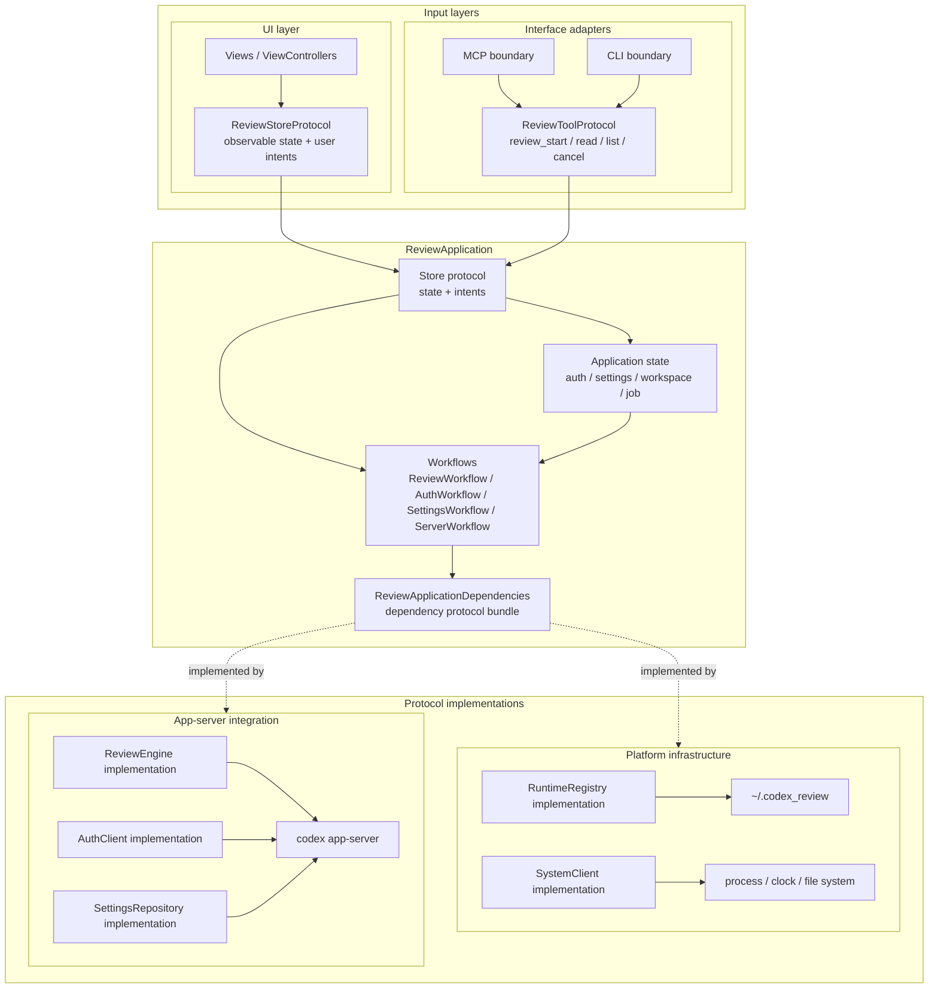
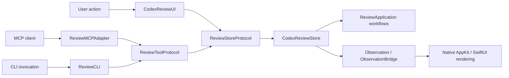
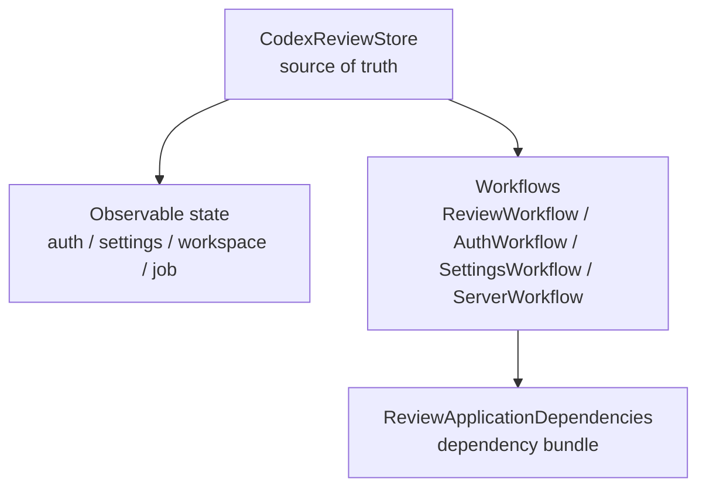
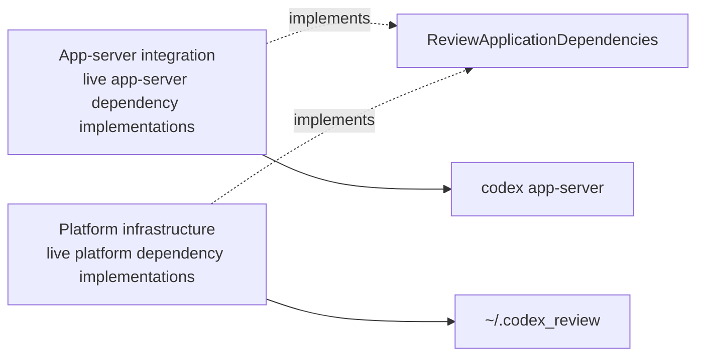
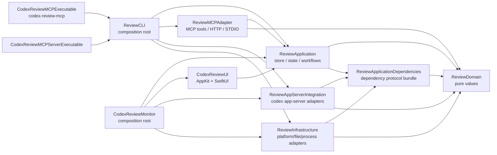
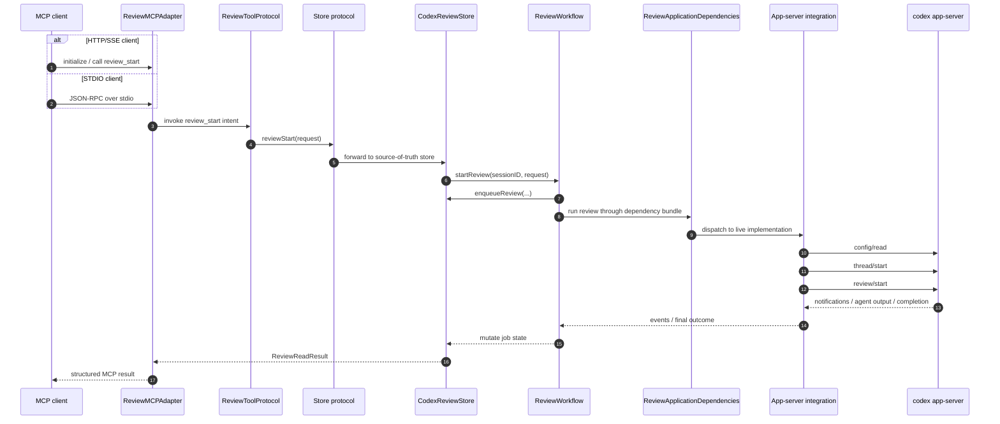
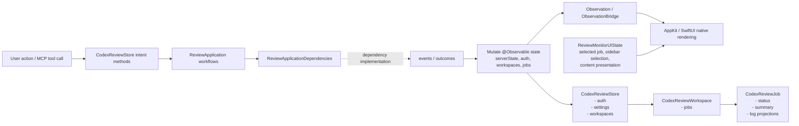
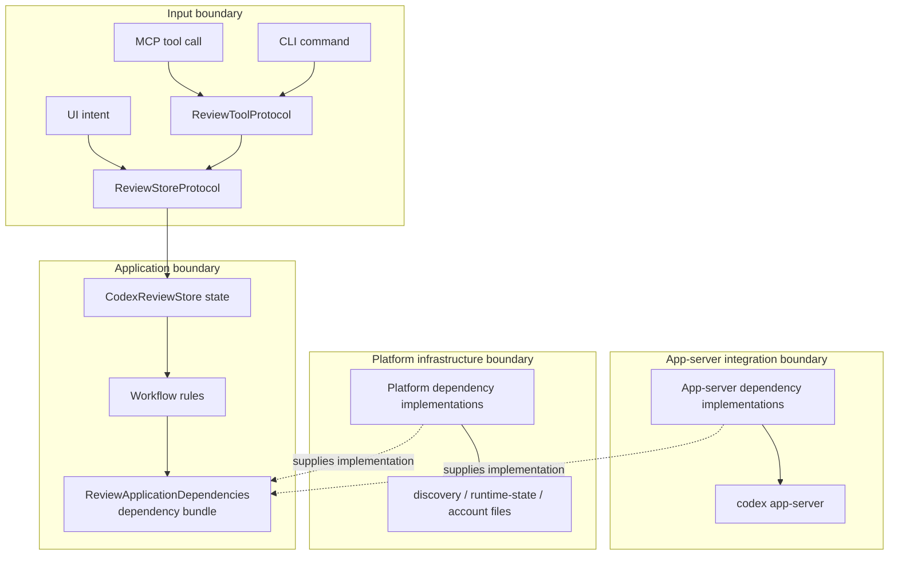

# Architecture Overview

作成日: 2026-05-02

このドキュメントは、CodexReviewMCP の現状の複雑さを踏まえ、整理後の依存方向を GitHub Mermaid で俯瞰するためのメモです。

ここでの目的は、議論しやすい粒度で「何を中心に置き、何を外側へ出すか」を見えるようにすることです。

## 全体像

この図では、各レイヤーが参照する protocol boundary を中心に描きます。live / test の差し替えは、この protocol の実装を入れ替えることで行います。

読み方:

- UI layer は外側の `ReviewStoreProtocol` だけを見ます。AppKit/SwiftUI は `CodexReviewStore` の concrete 実装を直接組み立てません。
- MCP / CLI は `ReviewToolProtocol` だけを見ます。tool call の decode/encode と store intent の橋渡しに限定します。
- `ReviewApplication` の接続は `Store protocol -> state/workflows -> ReviewApplicationDependencies` です。外側から workflow や個別 dependency protocol を直接触らせません。
- workflow は app-server や file system の concrete 実装を知りません。
- `App-server integration` は app-server 系 protocol の live 実装だけを持ちます。
- `Platform infrastructure` は runtime registry、clock、process、file system の live 実装だけを持ちます。
- test 用実装は図に出していません。`ReviewApplicationDependencies` に準拠する実装へ差し替える前提です。

### 対応表

| Area | 主な場所 | 役割 |
| --- | --- | --- |
| UI layer | `Sources/CodexReviewUI` | AppKit/SwiftUI の native rendering。`@Observable` state を直接 observe する |
| Interface adapters | `Sources/ReviewMCPAdapter`, `Sources/ReviewCLI` | MCP / CLI の入力を application intent に変換する |
| ReviewApplication | `Sources/ReviewApplication` | `@Observable` state、workflow、dependency boundary を持つ中心層 |
| ReviewApplicationDependencies | `Sources/ReviewApplicationDependencies` | レイヤー間で受け渡す dependency protocol bundle |
| App-server integration | `Sources/ReviewAppServerIntegration` | `codex app-server` との protocol、auth、config/read、review/start を扱う |
| Platform infrastructure | `Sources/ReviewInfrastructure` | discovery、runtime state、account files、clock/process/file system などの live dependency 実装 |
| ReviewDomain | `Sources/ReviewDomain` | request / response / settings / account key などの pure value |

注意点:

- `ReviewApplication` は `ReviewInfrastructure` / `ReviewAppServerIntegration` を import しません。
- 個別 protocol は `ReviewApplicationDependencies` の内側に隠し、レイヤー間では bundle として受け渡します。
- live wiring は app / executable などの composition root に置きます。
- UI layer と app-server integration は直接依存しません。
- `ReviewRuntime` は独立 target として残さず、`CodexReviewJob` / `CodexReviewWorkspace` などの observable state は `ReviewApplication` に寄せます。
- UI は `CodexReviewStore` / `CodexReviewWorkspace` / `CodexReviewJob` を直接 observe します。描画用 ViewModel や mirror state は追加しません。

## 境界別の詳細

全体図に concrete type を全部載せると読めなくなるため、詳細は protocol boundary ごとに分けます。

### UI と入力

### Application 内部

### 外部連携

## Swift Package ターゲット依存

矢印は「左の target が右の target を import / depend している」向きです。

この図では、現状の `ReviewApp -> ReviewInfra` を削除しています。依存 bundle は `ReviewApplicationDependencies` に切り出し、`ReviewApplication` / `ReviewAppServerIntegration` / `ReviewInfrastructure` が同じ dependency target を見る形にします。UI layer は application だけを見て、app-server integration を見ません。app / CLI が live wiring を担います。互換性維持のための facade target は削除します。

## 何を壊してよいか

| 現状 | 整理後 |
| --- | --- |
| `ReviewApp` が `ReviewInfra` を直接 import する | `ReviewApplication` は dependency bundle の境界だけを持ち、live 実装を知らない |
| UI と app-server 連携が同じ外側の関心として見える | UI layer と app-server integration を分け、composition root でだけ合流させる |
| `ReviewMonitorServerRuntime` に server/settings/auth/recycle が集中する | `ServerWorkflow`, `SettingsWorkflow`, `AuthWorkflow`, `ReviewWorkflow` に分ける |
| `ReviewRuntime` が job state の別 target になっている | observable state は `ReviewApplication` に集約する |
| facade target が re-export で依存を隠す | composition root が明示的に組み立てる |

## 最初の実装単位

1. 既存の `ReviewApp` を `ReviewApplication` に改名/再編し、`CodexReviewStore` / auth / settings / workspace / job state を集約する。
2. `ReviewApplicationDependencies` を新設し、レイヤー間で受け渡す dependency bundle を定義する。最初は `ReviewEngine`, `AuthClient`, `SettingsRepository`, `RuntimeRegistry`, `SystemClient` 程度を内包すればよい。
3. `ReviewAppServerIntegration` に app-server 連携を移す。`AppServerSupervisor`, `AppServerReviewRunner`, auth session、`config/read` はここへ閉じ込める。
4. `ReviewInfrastructure` に platform infrastructure を移す。local config/discovery/account registry、clock/process/file system はここへ閉じ込める。
5. `CodexReviewUI` と MCP adapter は `ReviewApplication` だけを見る。

## review_start の実行フロー

STDIO クライアントの場合も HTTP/SSE クライアントの場合も、MCP adapter は request を store intent に変換します。review 実行の live details は `ReviewApplicationDependencies` の実装側に閉じ込めます。

補足:

- `review_start` は最終結果まで待つ primary flow です。
- `review_read` / `review_list` は `CodexReviewStore` 上の session-scoped job state を読むだけの軽い経路です。
- `review_cancel` は `ReviewWorkflow` から `ReviewApplicationDependencies` へ cancellation を渡し、live 実装が app-server の interrupt / cleanup details を扱います。

## State と Observation の流れ

整理後の state ownership:

- `CodexReviewStore` が UI と MCP server の両方から使われる root state です。
- `CodexReviewAuthModel` は認証・アカウント選択の source of truth です。
- `CodexReviewWorkspace` は cwd ごとの job grouping と展開状態を持ちます。
- `CodexReviewJob` は review status、summary、thread/turn ID、log entry と表示用 projection を持ちます。
- `ReviewMonitorUIState` は選択中 job や sidebar selection など、画面固有の一時 UI state を持ちます。
- AppKit controller は `ObservationBridge` の `ObservationScope` で store/job を直接 observe し、native view を更新します。

## 主な責務境界

責務の読み方:

- Input boundary は intent 変換だけを担当します。
- Application boundary は state と workflow rules を持ち、外部副作用は `ReviewApplicationDependencies` に閉じます。
- App-server integration boundary は `codex app-server` protocol details を担当します。UI layer からは直接見えません。
- Platform infrastructure boundary は file/process/clock/runtime registry を担当します。application state を直接所有しません。

## 見直し時の起点

現状把握から見える、次に議論しやすい論点です。

1. `ReviewApplication` を中心に置き、`ReviewApp --> ReviewInfra` の直接依存を消します。
2. `ReviewRuntime` は独立 target として残さず、observable state を `ReviewApplication` に寄せます。
3. facade target は互換性維持目的なら削除します。composition root が live wiring を明示的に持つ方が読みやすいです。
4. `ReviewMonitorServerRuntime` / `CodexReviewStoreRuntime.swift` に集まっている server lifecycle、settings、auth seed、runtime recycle を workflow と dependency bundle に分解します。
5. UI は直接 observation で描画しており、余分な ViewModel 層はありません。この点は維持します。
