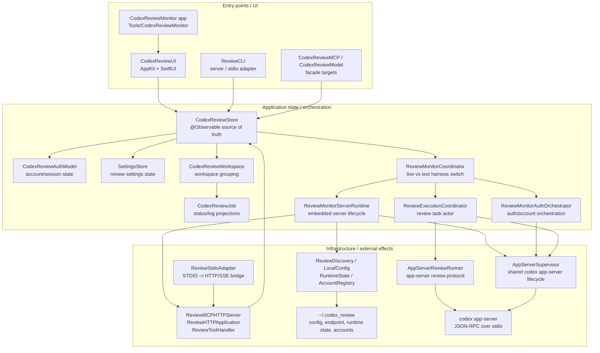
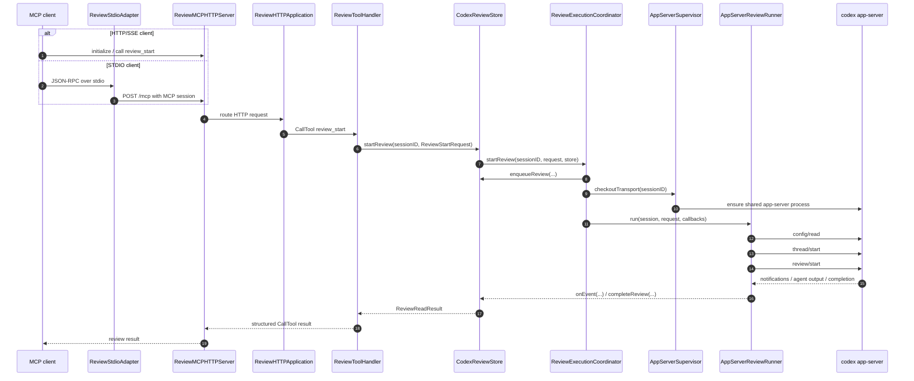
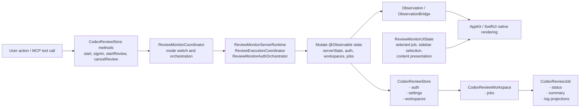
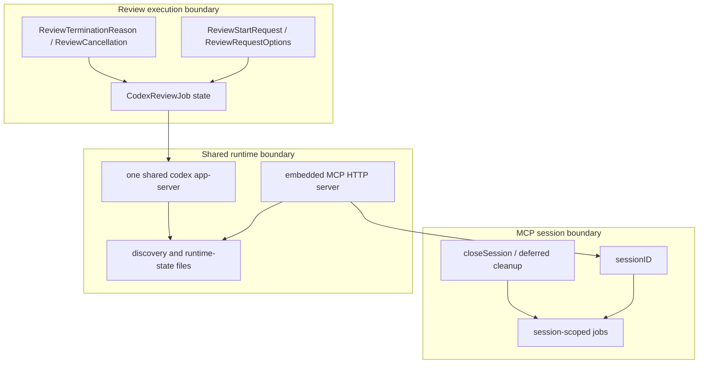

# Architecture Overview

作成日: 2026-05-02

このドキュメントは、CodexReviewMCP の現状を GitHub Mermaid で俯瞰するためのメモです。

ここでの目的は「いま何がどこにあるか」を見えるようにすることです。移行案やリファクタリング方針は、別途この図を起点に判断します。

## 全体像

### 現状の対応表

| Area | 現在の主な場所 | 役割 |
| --- | --- | --- |
| Entry points / UI | `Sources/CodexReviewUI`, `Tools/CodexReviewMonitor`, `Sources/ReviewCLI` | AppKit/SwiftUI UI、CLI entry point、STDIO/HTTP の起動口 |
| Application state / orchestration | `Sources/ReviewApp`, `Sources/ReviewRuntime`, `Sources/ReviewDomain` | `@Observable` state、認証/設定/レビュー実行の orchestration、job/workspace/domain model |
| Infrastructure / external effects | `Sources/ReviewInfra` | MCP HTTP server、STDIO adapter、`codex app-server` supervisor、設定/発見/永続化ファイル、外部 process IO |

注意点:

- 現状の target 名と責務境界は完全には一致していません。
- `ReviewApp` は application state の中心ですが、embedded server lifecycle や auth runtime など一部 infrastructure 寄りの責務も握っています。
- `ReviewInfra` は外部副作用の集約先ですが、`ReviewRuntime` に依存しているため、純粋な下位 infrastructure 層としてはまだ境界が混ざっています。
- UI は `CodexReviewStore` / `CodexReviewWorkspace` / `CodexReviewJob` を直接 observe しており、`Observation + direct native rendering` に近い構成です。

## Swift Package ターゲット依存

矢印は「左の target が右の target を import / depend している」向きです。

```mermaid
flowchart LR
    ReviewDomain["ReviewDomain<br/>review target / responses / settings / accounts"]
    ReviewRuntime["ReviewRuntime<br/>CodexReviewJob"]
    ReviewInfra["ReviewInfra<br/>HTTP / STDIO / app-server / config"]
    ReviewApp["ReviewApp<br/>store / coordinator / runtime / auth"]
    CodexReviewUI["CodexReviewUI<br/>AppKit + SwiftUI"]
    ReviewCLI["ReviewCLI<br/>server and adapter commands"]
    CodexReviewMCP["CodexReviewMCP<br/>facade"]
    CodexReviewModel["CodexReviewModel<br/>facade"]
    ReviewCoreFacade["ReviewCore<br/>facade"]
    ReviewHTTPFacade["ReviewHTTPServer<br/>facade"]
    ReviewStdioFacade["ReviewStdioAdapter<br/>facade"]
    MCPExecutable["CodexReviewMCPExecutable<br/>codex-review-mcp"]
    MCPServerExecutable["CodexReviewMCPServerExecutable"]

    ReviewRuntime --> ReviewDomain
    ReviewInfra --> ReviewDomain
    ReviewInfra --> ReviewRuntime
    ReviewApp --> ReviewDomain
    ReviewApp --> ReviewRuntime
    ReviewApp --> ReviewInfra
    CodexReviewUI --> ReviewApp
    CodexReviewUI --> ReviewDomain
    CodexReviewUI --> ReviewRuntime
    ReviewCLI --> ReviewApp
    ReviewCLI --> ReviewInfra
    CodexReviewMCP --> ReviewApp
    CodexReviewMCP --> ReviewDomain
    CodexReviewMCP --> ReviewRuntime
    CodexReviewModel --> ReviewApp
    CodexReviewModel --> ReviewDomain
    CodexReviewModel --> ReviewRuntime
    ReviewCoreFacade --> ReviewInfra
    ReviewHTTPFacade --> ReviewInfra
    ReviewStdioFacade --> ReviewInfra
    MCPExecutable --> ReviewCLI
    MCPServerExecutable --> ReviewCLI
```

この図で見ると、現状の中核は `ReviewApp -> ReviewInfra` と `CodexReviewUI -> ReviewApp` です。UI は Model に乗り、Model が Infra を呼び出す構成になっています。

## review_start の実行フロー

STDIO クライアントの場合は `ReviewStdioAdapter` を通ります。HTTP/SSE クライアントの場合は `ReviewMCPHTTPServer` に直接入ります。

補足:

- `review_start` は最終結果まで待つ primary flow です。
- `review_read` / `review_list` は `CodexReviewStore` 上の session-scoped job state を読むだけの軽い経路です。
- `review_cancel` は `ReviewExecutionCoordinator` に termination reason を記録し、bootstrap 中なら transport/task を止め、実行中なら app-server の `turn/interrupt` に進みます。

## State と Observation の流れ

現状の state ownership:

- `CodexReviewStore` が UI と MCP server の両方から使われる root state です。
- `CodexReviewAuthModel` は認証・アカウント選択の source of truth です。
- `CodexReviewWorkspace` は cwd ごとの job grouping と展開状態を持ちます。
- `CodexReviewJob` は review status、summary、thread/turn ID、log entry と表示用 projection を持ちます。
- `ReviewMonitorUIState` は選択中 job や sidebar selection など、画面固有の一時 UI state を持ちます。
- AppKit controller は `ObservationBridge` の `ObservationScope` で store/job を直接 observe し、native view を更新します。

## 主な責務境界

責務の読み方:

- MCP session は HTTP transport の session と、store 内の job 所有権を結びます。
- Review execution は job 単位で `ReviewExecutionCoordinator` が Task と cancellation を管理します。
- Shared runtime は `ReviewMonitorServerRuntime` と `AppServerSupervisor` が扱い、HTTP endpoint discovery と app-server runtime state を `~/.codex_review` に反映します。

## 見直し時の起点

現状把握から見える、次に議論しやすい論点です。

1. `ReviewApp` の中に application state と runtime lifecycle が同居しているため、`Store/Service` と infrastructure client の境界を先に決める必要があります。
2. `CodexReviewStore` の API は個別 method です。イベント処理を統一するか、現状の explicit method を維持するかは、テスト容易性と変更頻度で判断できます。
3. `ReviewInfra` が `ReviewRuntime` に依存しているため、厳密な層構造にするなら job projection/state をどこに置くかを再検討する余地があります。
4. UI は直接 observation で描画しており、余分な ViewModel 層はありません。この点は `Observation + Single Source of Truth` と相性がよいです。
5. `ReviewMonitorServerRuntime` / `CodexReviewStoreRuntime.swift` は起動、設定、認証、server recycle、account seed などが集まっているため、責務を分ける場合の最初の候補です。
