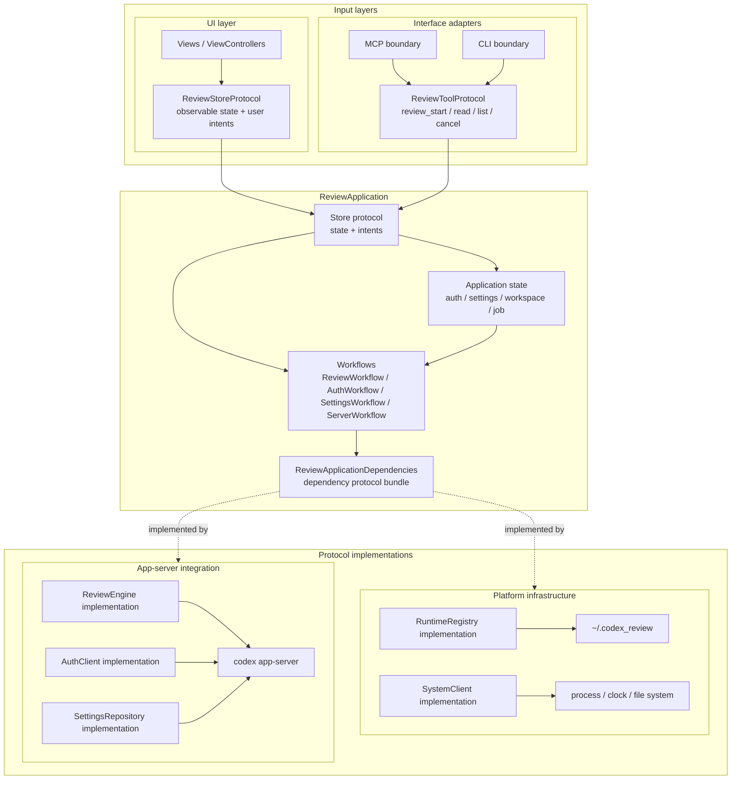
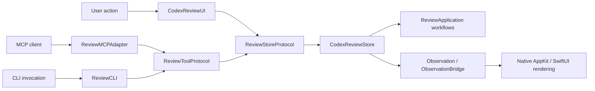
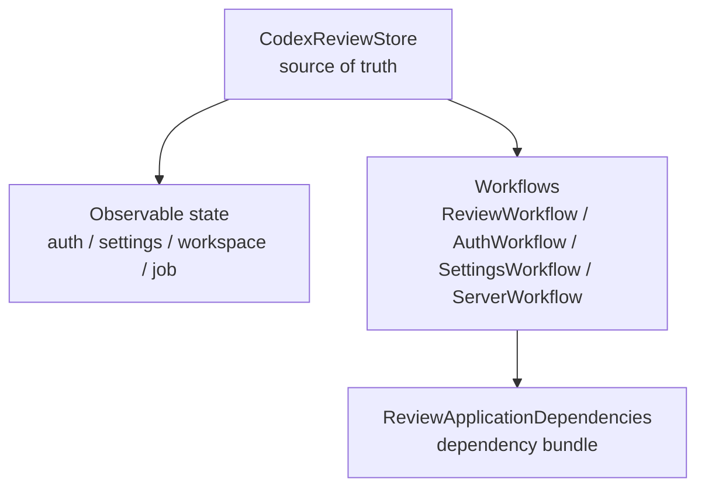
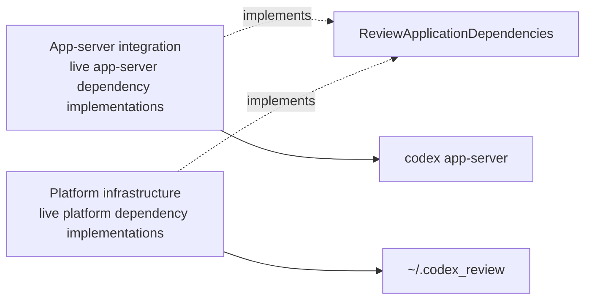
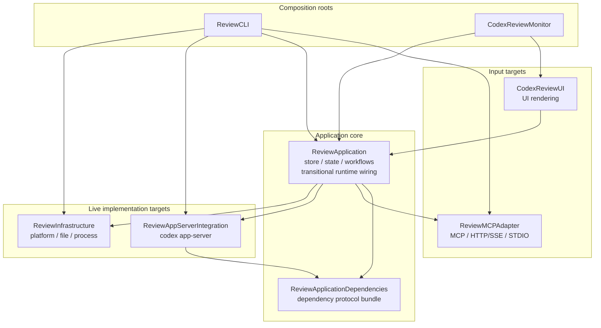
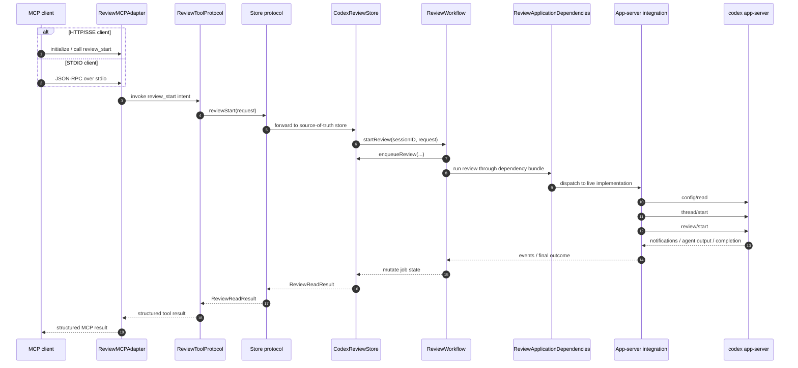
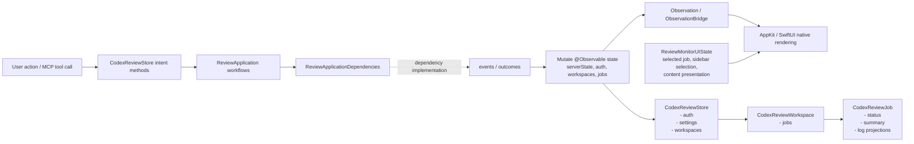
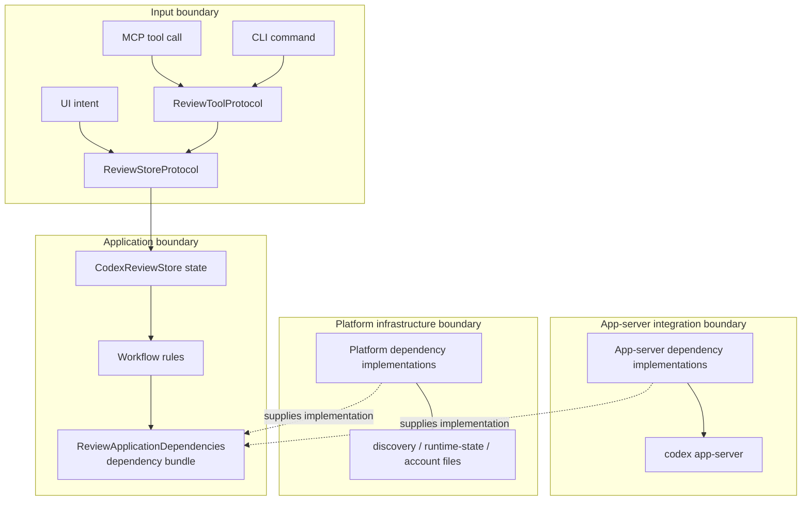

# Architecture Overview

作成日: 2026-05-02

このドキュメントは、CodexReviewMCP の現状の複雑さを踏まえ、整理後の依存方向を GitHub Mermaid で俯瞰するためのメモです。

ここでの目的は、議論しやすい粒度で「何を中心に置き、何を外側へ出すか」を見えるようにすることです。

## 全体像

この図では、各レイヤーが参照する protocol boundary を中心に描きます。矢印は target import ではなく、boundary の参照方向と実装関係です。live / test の差し替えは、この protocol の実装を入れ替えることで行います。

この上位図は目標設計です。SwiftPM target の実装状態は後述の「Swift Package ターゲット依存」に分けて書きます。

読み方:

- UI layer は `ReviewApplication` の store/state を直接 observe します。ただし `CodexReviewStore` の生成や live dependency wiring は composition root に置き、UI から app-server integration は見ません。
- MCP / CLI は `ReviewToolProtocol` だけを見ます。tool call の decode/encode と store intent の橋渡しに限定します。
- `ReviewApplication` の接続は `Store protocol -> state/workflows -> ReviewApplicationDependencies` です。外側から workflow や個別 dependency protocol を直接触らせません。
- workflow は app-server や file system の concrete 実装を知りません。
- `App-server integration` は app-server 系 protocol の live 実装だけを持ちます。
- `Platform infrastructure` は runtime registry、clock、process、file system の live 実装だけを持ちます。
- test 用実装は図に出していません。`ReviewApplicationDependencies` に準拠する実装へ差し替える前提です。

### 対応表

| Area | 主な場所 | 役割 |
| --- | --- | --- |
| UI layer | `Sources/CodexReviewUI` | AppKit/SwiftUI の native rendering。`@Observable` state を直接 observe する |
| Interface adapters | `Sources/ReviewMCPAdapter` | MCP / HTTP/SSE / STDIO の入力を application intent に変換する |
| ReviewApplication | `Sources/ReviewApplication` | `@Observable` state、workflow、dependency boundary を持つ中心層 |
| ReviewApplicationDependencies | `Sources/ReviewApplicationDependencies` | レイヤー間で受け渡す dependency protocol bundle |
| App-server integration | `Sources/ReviewAppServerIntegration` | `codex app-server` との protocol、auth、config/read、review/start を扱う |
| Platform infrastructure | `Sources/ReviewInfrastructure` | discovery、runtime state、account files、clock/process/file system などの live dependency 実装 |
| ReviewDomain | `Sources/ReviewDomain` | request / response / settings / account key などの pure value |
| Composition roots | `Sources/ReviewCLI`, `Tools/CodexReviewMonitor` | application、adapter、live implementation を組み立てる |

設計上の注意点:

- 最終ゴールでは、`ReviewApplication` は `ReviewInfrastructure` / `ReviewAppServerIntegration` を import しません。
- 個別 protocol は `ReviewApplicationDependencies` の内側に隠し、レイヤー間では bundle として受け渡します。
- live wiring は app / executable などの composition root に置きます。
- UI layer と app-server integration は直接依存しません。
- `ReviewRuntime` は独立 target として残さず、`CodexReviewJob` / `CodexReviewWorkspace` などの observable state は `ReviewApplication` に寄せます。
- UI は `CodexReviewStore` / `CodexReviewWorkspace` / `CodexReviewJob` を直接 observe します。描画用 ViewModel や mirror state は追加しません。

## 境界別の詳細

全体図に concrete type を全部載せると読めなくなるため、詳細は protocol boundary ごとに分けます。

### UI と入力

この図の矢印は user/tool input が store intent に変換され、Observation で native UI に反映される流れです。target import 依存ではありません。

### Application 内部

この図の矢印は `ReviewApplication` 内部の状態更新と workflow 呼び出しの流れです。

### 外部連携

この図の点線は `ReviewApplicationDependencies` に対する live 実装の提供関係です。

## Swift Package ターゲット依存

PR4 時点の target 一覧です。facade target は削除し、`ReviewApp` は `ReviewApplication` に改名済みです。

### 実装フェーズ上の注意

PR4 では target rename、`ReviewRuntime` の吸収、facade target 削除を行います。`ReviewApplication` にはまだ monitor/server の live wiring が残っているため、最終目標の「application core は dependency boundary だけを見る」状態へは、`ReviewMonitorServerRuntime` / `CodexReviewStoreRuntime.swift` の workflow 分割でさらに進めます。

### 再編後の target 一覧

| Target | 種別 | 役割 | 依存先 |
| --- | --- | --- | --- |
| `ReviewDomain` | library | request / response / settings / account / cancellation などの pure value | なし |
| `ReviewApplicationDependencies` | library | `ReviewApplication` が外部副作用を呼ぶための dependency protocol bundle | `ReviewDomain` |
| `ReviewApplication` | library | `CodexReviewStore`、observable state、workflow、monitor/server runtime wiring | `ReviewApplicationDependencies`, `ReviewAppServerIntegration`, `ReviewDomain`, `ReviewInfrastructure`, `ReviewMCPAdapter`, `ObservationBridge` |
| `CodexReviewUI` | library | AppKit / SwiftUI の direct native rendering | `ReviewApplication`, `ReviewDomain`, `ObservationBridge` |
| `ReviewMCPAdapter` | library | MCP / HTTP/SSE / STDIO の入力を handler closure に変換する adapter | `ReviewDomain`, `ReviewInfrastructure`, `MCP`, `NIO`, `Logging` |
| `ReviewAppServerIntegration` | library | `codex app-server` と話す live dependency 実装 | `ReviewApplicationDependencies`, `ReviewDomain`, `ReviewInfrastructure`, `MCP`, `TOMLDecoder` |
| `ReviewInfrastructure` | library | file/process/clock/runtime registry/local config の live dependency 実装 | `ReviewDomain` |
| `ReviewCLI` | library | CLI / executable の composition root | `ReviewApplication`, `ReviewMCPAdapter`, `ReviewAppServerIntegration`, `ReviewInfrastructure`, `Logging` |
| `CodexReviewMCPExecutable` | executable | `codex-review-mcp` entry point | `ReviewCLI` |
| `CodexReviewMCPServerExecutable` | executable | server executable entry point | `ReviewCLI` |
| `ReviewTestSupport` | test support library | fake dependencies、deterministic clock、test builders | `ReviewApplication`, `ReviewAppServerIntegration`, `ReviewDomain`, `ReviewInfrastructure`, `ReviewMCPAdapter` |

`CodexReviewMonitor` は SwiftPM target ではなく Xcode app target です。PR4 時点では `ReviewApplication` / `CodexReviewUI` を直接参照します。

### 削除または吸収する target

| 現 target | 方針 |
| --- | --- |
| `ReviewInfra` | `ReviewMCPAdapter`, `ReviewAppServerIntegration`, `ReviewInfrastructure` に分割して廃止 |
| `ReviewRuntime` | `ReviewApplication` に吸収。job/workspace の observable state は application state として扱う |
| `ReviewCore` | facade target なので削除 |
| `ReviewHTTPServer` | facade target なので削除。HTTP/SSE adapter は `ReviewMCPAdapter` へ移す |
| `ReviewStdioAdapter` | facade target なので削除。STDIO adapter は `ReviewMCPAdapter` へ移す |
| `CodexReviewModel` | facade target なので削除 |
| `CodexReviewMCP` | facade target なので削除。app / CLI の composition root が必要 target を明示 import する |

次の図では SwiftPM の主要 edge を描きます。`ReviewDomain` は pure values として多くの target から参照されるため、図からは省略します。executable から composition root への依存も下の表に分けます。

この図では、互換性維持のための facade target は削除済みです。一方で、`ReviewApplication` 内に server runtime / auth orchestration / live store factory が残っているため、`ReviewApplication -> ReviewMCPAdapter / ReviewAppServerIntegration / ReviewInfrastructure` の edge はまだあります。

補足:

- `ReviewDomain` は shared value target です。`ReviewApplication`, `ReviewApplicationDependencies`, adapter, live implementation から参照されますが、主要な依存を読みやすくするため図では省略しています。
- `CodexReviewMCPExecutable` と `CodexReviewMCPServerExecutable` はどちらも `ReviewCLI` だけに依存します。
- `ReviewTestSupport` は production target から参照しません。

### Composition root wiring

| Composition root | 組み立てる target |
| --- | --- |
| `ReviewCLI` | `ReviewApplication`, `ReviewMCPAdapter`, `ReviewAppServerIntegration`, `ReviewInfrastructure` |
| `CodexReviewMonitor` | `ReviewApplication`, `CodexReviewUI` |
| `CodexReviewMCPExecutable` | `ReviewCLI` |
| `CodexReviewMCPServerExecutable` | `ReviewCLI` |

## 残りの整理方針

| 現状 | 目標 |
| --- | --- |
| `ReviewApplication` が monitor/server runtime wiring 経由で live implementation targets を import している | `ReviewApplication` は dependency bundle の境界だけを持ち、live 実装を知らない |
| UI と app-server 連携が同じ外側の関心として見える | UI layer と app-server integration を分け、composition root でだけ合流させる |
| `ReviewMonitorServerRuntime` に server/settings/auth/recycle が集中する | `ServerWorkflow`, `SettingsWorkflow`, `AuthWorkflow`, `ReviewWorkflow` に分ける |
| live store factory が `ReviewApplication` に残っている | app / CLI の composition root が live wiring を明示的に組み立てる |

## 実装単位

1. 済: `ReviewDomain` から MCP conversion を外し、wire conversion を adapter 側へ寄せる。
2. 済: `ReviewApplicationDependencies` を新設し、review execution boundary として `ReviewEngine` を置く。
3. 済: `ReviewMCPAdapter` / `ReviewAppServerIntegration` / `ReviewInfrastructure` の実体 target を作り、旧 `ReviewInfra` の中身を分ける。
4. 済: `ReviewApp` を `ReviewApplication` へ改名し、`ReviewRuntime` を吸収し、facade target を削除する。
5. 未完: `ReviewMonitorServerRuntime` / `CodexReviewStoreRuntime.swift` に残る live wiring を workflow と dependency bundle に分解し、`ReviewApplication` から live implementation target への import を消す。

## review_start の実行フロー

STDIO クライアントの場合も HTTP/SSE クライアントの場合も、MCP adapter は request を store intent に変換します。review 実行の live details は `ReviewApplicationDependencies` の実装側に閉じ込めます。

この sequence の矢印は `review_start` の呼び出しと結果返却の流れです。target import 依存ではありません。

補足:

- `review_start` は最終結果まで待つ primary flow です。
- `review_read` / `review_list` は `CodexReviewStore` 上の session-scoped job state を読むだけの軽い経路です。
- `review_cancel` は `ReviewWorkflow` から `ReviewApplicationDependencies` へ cancellation を渡し、live 実装が app-server の interrupt / cleanup details を扱います。

## State と Observation の流れ

この図の矢印は状態更新と observation delivery の流れです。`ReviewApplicationDependencies` 以外は target import 依存を表していません。

整理後の state ownership:

- `CodexReviewStore` が UI と MCP server の両方から使われる root state です。
- `CodexReviewAuthModel` は認証・アカウント選択の source of truth です。
- `CodexReviewWorkspace` は cwd ごとの job grouping と展開状態を持ちます。
- `CodexReviewJob` は review status、summary、thread/turn ID、log entry と表示用 projection を持ちます。
- `ReviewMonitorUIState` は選択中 job や sidebar selection など、画面固有の一時 UI state を持ちます。
- AppKit controller は `ObservationBridge` の `ObservationScope` で store/job を直接 observe し、native view を更新します。

## 主な責務境界

この図の矢印は boundary をまたぐ intent / workflow / external effect の流れです。target import 依存は Swift Package ターゲット依存の図だけで扱います。

責務の読み方:

- Input boundary は intent 変換だけを担当します。
- Application boundary は state と workflow rules を持ち、外部副作用は `ReviewApplicationDependencies` に閉じます。
- App-server integration boundary は `codex app-server` protocol details を担当します。UI layer からは直接見えません。
- Platform infrastructure boundary は file/process/clock/runtime registry を担当します。application state を直接所有しません。

## 見直し時の起点

現状把握から見える、次に議論しやすい論点です。

1. `ReviewMonitorServerRuntime` / `CodexReviewStoreRuntime.swift` に集まっている server lifecycle、settings、auth seed、runtime recycle を workflow と dependency bundle に分解します。
2. その後で `ReviewApplication -> ReviewMCPAdapter / ReviewAppServerIntegration / ReviewInfrastructure` の target edge を消します。
3. UI は直接 observation で描画しており、余分な ViewModel 層はありません。この点は維持します。
