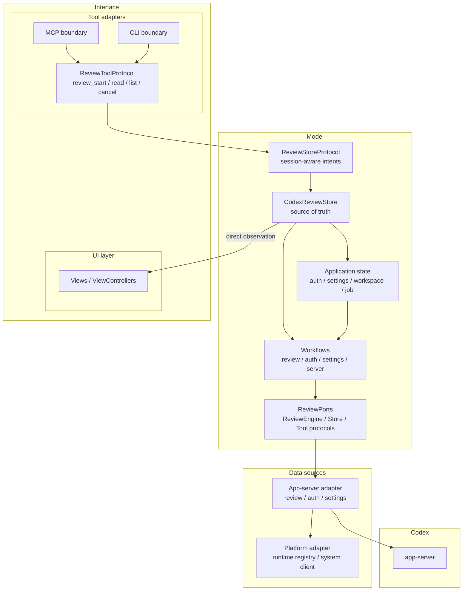
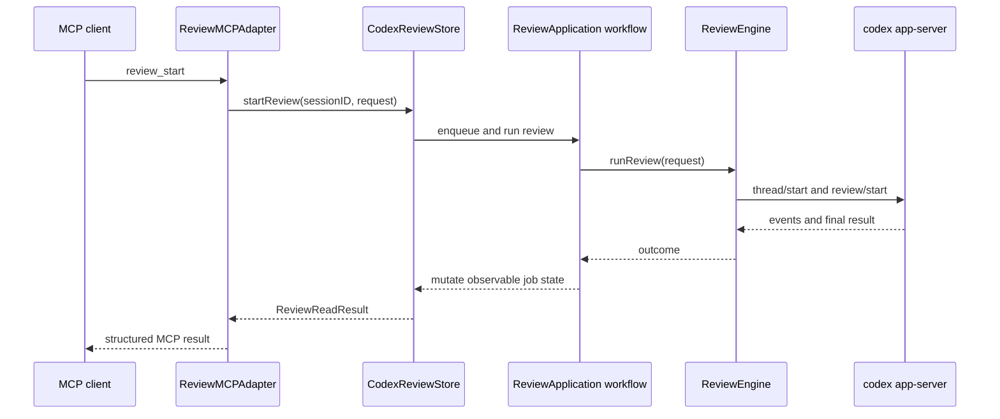

# Architecture

CodexReviewMCP exposes Codex review as MCP tools and as a small macOS monitor app. The main design goal is to keep application state and review workflow rules independent from live processes, files, and MCP transport details.

## Overview

## Layers

| Layer | Responsibility |
| --- | --- |
| Interface | UI rendering plus MCP/CLI boundaries that send user or tool intents into the model |
| Model | `ReviewApplication` state, source-of-truth store, workflows, and protocol boundaries |
| Data sources | Live adapters and platform primitives that isolate external effects from the model |
| Codex | Codex-owned `app-server` process used by the app-server adapter |
| Domain values | Pure request, response, settings, account, job, and cancellation values shared across layers |

## Design Principles

- UI observes concrete application state directly. There is no ViewModel or mirror-state layer for rendering.
- MCP and CLI tool calls are converted into session-scoped application intents.
- Review execution side effects are hidden behind protocol boundaries, so workflows do not know app-server or file-system details.
- Live runtime wiring is centralized around the monitor/server runtime instead of being spread through UI or workflow code.
- Domain values stay pure and portable across UI, MCP, runtime, and app-server integration code.

## Review Flow

## Runtime State

ReviewMCP uses `~/.codex_review` as its dedicated Codex home for backend config
and runtime metadata. The shared `codex app-server` launched by ReviewMCP uses
the same home.
